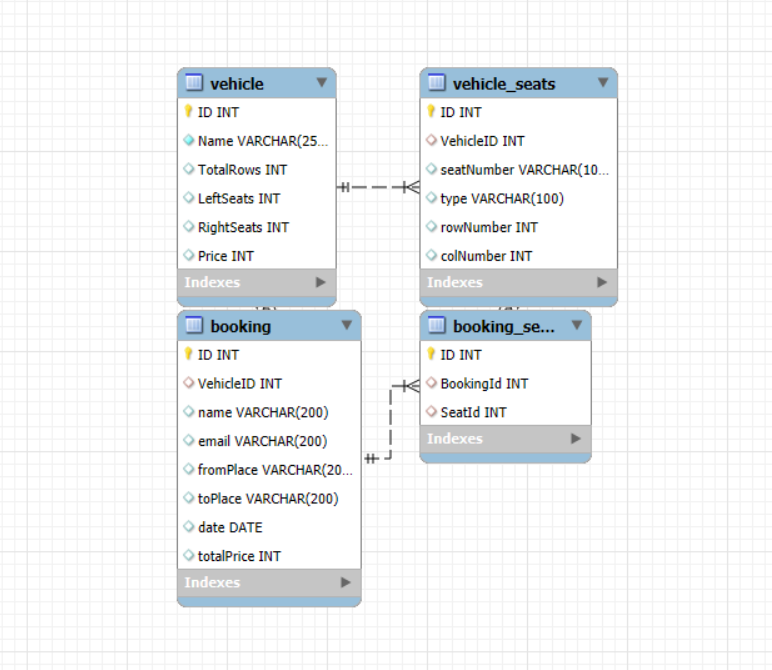

# Seat Reservation
## React, Express, and Mysql Project

## Project Overview

This project is a full-stack web application built using **React** (frontend), **Express.js** (backend), and **MySql** (database).

## Features

- **CRUD Operations** (Create, Read, Update, Delete data)
- **RESTful API** with Express.js
- **Mysql Database Integration**
- **State Management React Query**

## Tech Stack

### Frontend:

- React.js
- React Router
- Axios (for API calls)
- TailwindCSS

### Backend:

- Node.js
- Express.js
- Mysql
- Dotenv for environment variables

## Installation & Setup

### Prerequisites:

- Node.js installed ([Download Node.js](https://nodejs.org/))
- Mysql installed ([Download Mysql](https://dev.mysql.com/downloads/installer/))

### 1. Clone the Repository

```sh
git clone https://github.com/yourusername/your-repo.git
cd your-repo
```

### 2. Install Backend Dependencies

```sh
cd server
npm install
```
### 2. Import the db.sql
Import db.sql in the mysql database

### 3. Setup Environment Variables

Create a **.env** file in the **server/** directory:

```env
DATABASE_HOST=
DATABASE_NAME=
DATABASE_PORT=
DATABASE_USER=
DATABASE_PASSWORD=
```

### 4. Start the Backend Server

```sh
npm start
```

This will start the backend on `http://localhost:3000`

### 5. Install Frontend Dependencies

```sh
cd ../web
npm install
```
### 6. Create a **.env** file in the **web/** directory:

```env
VITE_API_BASE_URL=http://localhost:3000
VITE_API_SOCKET_BASE_URL=http://localhost:5001

```
### 6. Start the Frontend Server

```sh
npm run dev
```

This will start the frontend on `http://localhost:5174/`

## API Endpoints

| Method | Endpoint                    | Description                                 |
|--------|-----------------------------|---------------------------------------------|
| GET    | `/vehicle`                  | Get all vehicle list                        |
| POST   | `/vehicle`                  | Create a vehicle info with given sit layout |
| GET    | `/booking`                  | Get all bookings data                       |
| POST   | `/booking`                  | Create a booking                            |
| PUT    | `/booking/:id/booked-seats` | get list of booked seats of vehicle         |


## ER diagram of the application

